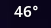
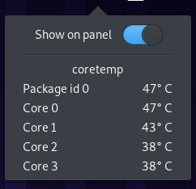

# Wingpanel Sensors Indicator

  

### Popover
  

---

## Building and Installation

You'll need the following dependencies:

    libgranite-dev
    libglib2.0-dev
    libgee-0.8-dev
    libgtk-3-dev
    libwingpanel-2.0-dev
    meson
    valac

Run `meson` to configure the build environment and then `ninja` to build

    meson build --prefix=/usr
    cd build
    ninja

To install, use `ninja install`

    sudo ninja install
