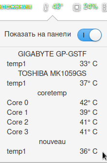

# Wingpanel Sensors Indicator

    

This indicator was merged with the pantheon-monitor (I think it will be more convenient this way). in the future, it will be switched to read-only mode
NOTE starting with kernel 5.5, if you want to monitor the temperature of drives, you need to add the "drivetemp" module to the startup

----

---

## Building and Installation

### You'll need the following dependencies:
* libglib2.0-dev
* libgee-0.8-dev
* libgtk-3-dev
* libwingpanel-2.0-dev
* meson
* valac

### How to build
    meson build --prefix=/usr
    ninja -C build
    sudo ninja -C build install
